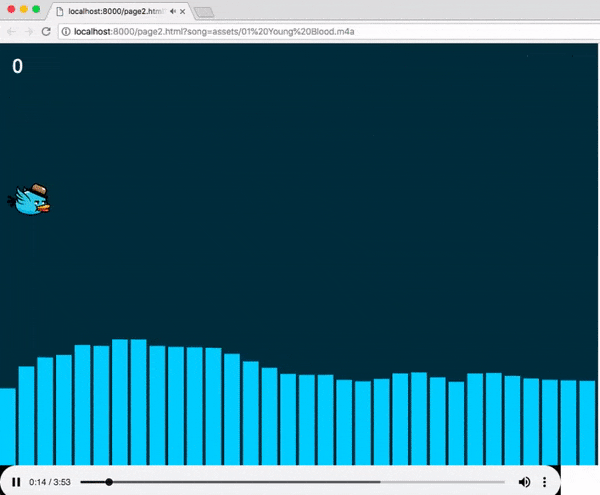

# Fowl Play Game

An interactive game with an Audio Visualizer component. Score accumulates for the entire song with unlimited lives

## GETTING STARTED

To play this game click on the link below and follow the instructions.

[Fowl Play Game](http://q1project_fowlplay.surge.sh/page1.html)

#### OPTION :
* Fork and Clone this repository.
* Run `python -m SimpleHTTPServer` command into the source folder.
* Open brower at localhost:8000/page1.html

### BEST FEATURE

You can catch the bird food with the beat of the song.

### TECHNOLOGIES

* Anime.js
* Phaser Js
* HTML5 Canvas
* Surge.sh
* JavaScript

